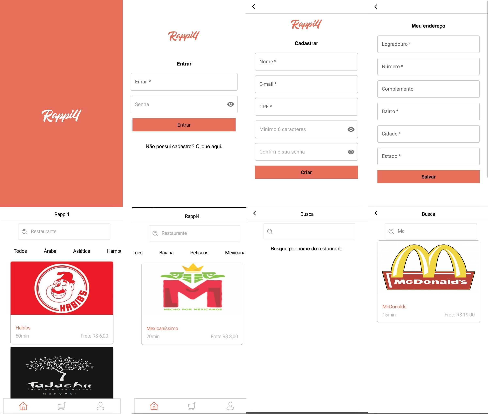
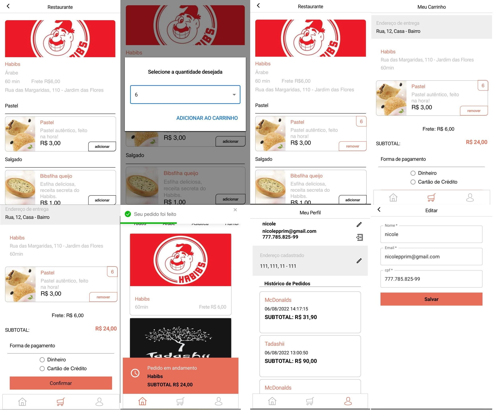

# Acesse o site:

<a href=http://alves-labe-food1.surge.sh/>Rappi4</a>

## Sobre / Funcionalidades:

Ao acessar o Rappi4, o usuário, se já tiver cadastro, poderá fazer o login e, caso não obtenha cadastro, poderá clicar na opção para cadastrar-se. Clicando nessa opção será redirecionado para a página de criação de cadastro onde informará os dados solicitados e, ao finalizar, será redirecionado para a página de cadastrar endereço. Após a realização de cadastro ou login, o usuário será redirecionado para a home, onde poderá visualizar todos os restaurantes disponíveis. 
Na home o usuário possui duas opções de filtro. Pode buscar o restaurante pelo nome, digitando-o ou pelo tipo de comida que procura. 
Na home o usuário tem acesso também ao rodapé, onde pode clicar no ícone do carrinho (será redirecionado à uma página onde poderá visualizar os produtos adicionados, o valor total e concluir o pedido ou excluí-lo), no ícone do perfil (poderá nesta página visualizar e editar seus dados e seu endereço, fazer logout e também visualizar seu histórico de pedidos). Existe também o ícone que o levará para a home.
Para escolher os produtos, o usuário deverá clicar no restaurante escolhido, clicar em "adicionar", selecionar a quantidade desejada e clicar em "adicionar ao carrinho". Se desejar, o usuário pode remover os produtos na mesma página em que os adicionou.
O layout do site foi todo realizado conforme proposto pela designer Camila Mizutani.
O projeto foi pensado como mobile first. 

## Em desenvolvimento:

- Loading
- Layout para desktop

## Tecnologias utilizadas:

- React
- Axios
- Styled Components
- Material UI
- JavaScript
- Toast React

## Desenvolvido por:

- Douglas Henrique Ferreira Barbosa
- Ilena Acioli dos Santos
- Lucas Magalhães Pacheco
- Nicole Prim
- Raquel Baptista Burger

## Imagens:

